# alfred_workflow__snippets_lab

Alfred3 workflow的使用中发现：
1. Alfred3 workflow的 "in keyword" 可以搜索到文本中包含关键字的文件，但是不能指定搜索范围
2. Alfred3 workflow的 "find keyword" 可以搜索到文件名包含关键字的文件或目录名，但是不能指定搜索范围
3. Alfred3 workflow的 "tags keyword" 可以搜索到tag包含关键字的文件或目录名，但是不能指定搜索范围

所以尝试使用pyhton脚本完成指定搜索范围的功能；在查找到搜索结果之后，可以定义后续动作为：
- [ ] 拷贝到剪切板
- [ ] 打开文件
- [ ] 打开文件所在的目录

# snippets_lab
> 1. 功能：利用alfred workflow功能，快捷查找自定义目录下的code snippets
> 2. 依赖：python3，alfred3
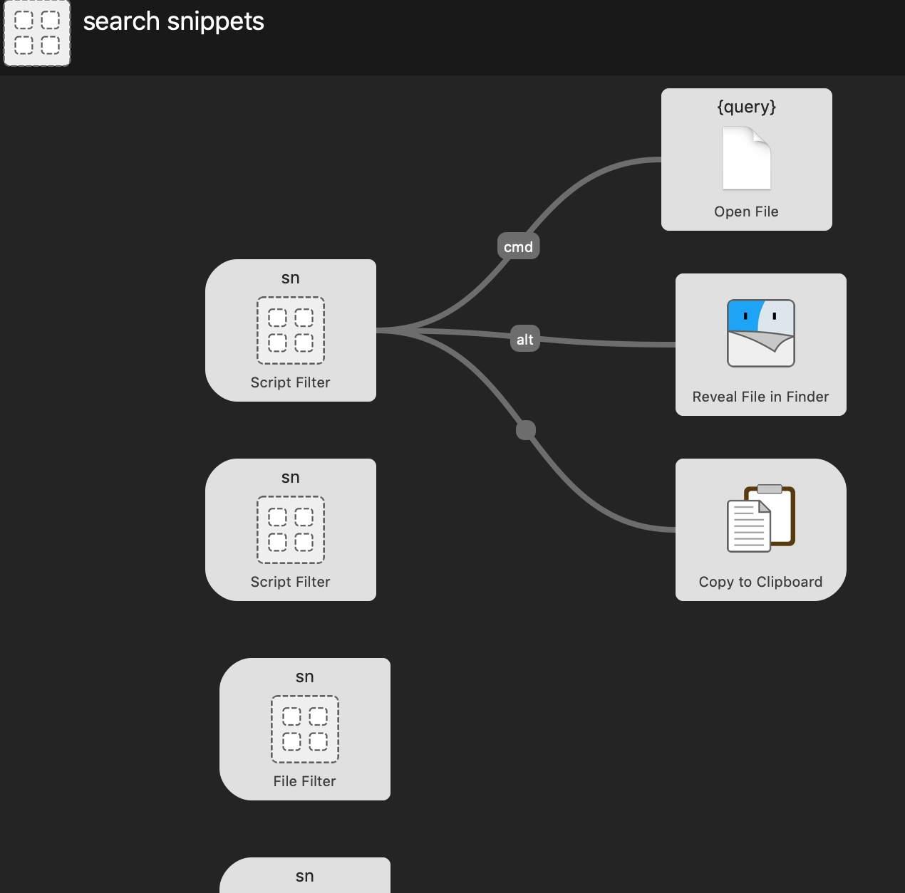

## 通过tag搜索文件
> 1. 安装tag命令： brew install tag
> 2. 配置workflow：
首先，创建第一个script filter
配置如下：
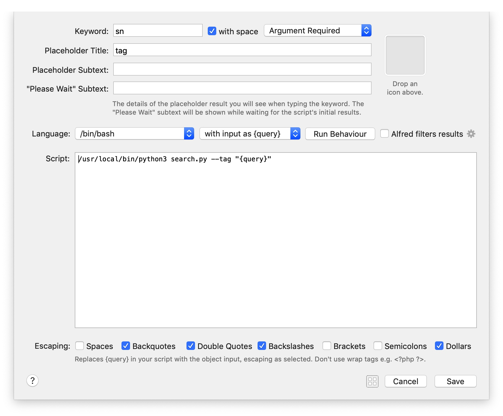
后续操作配置如下：
open file：
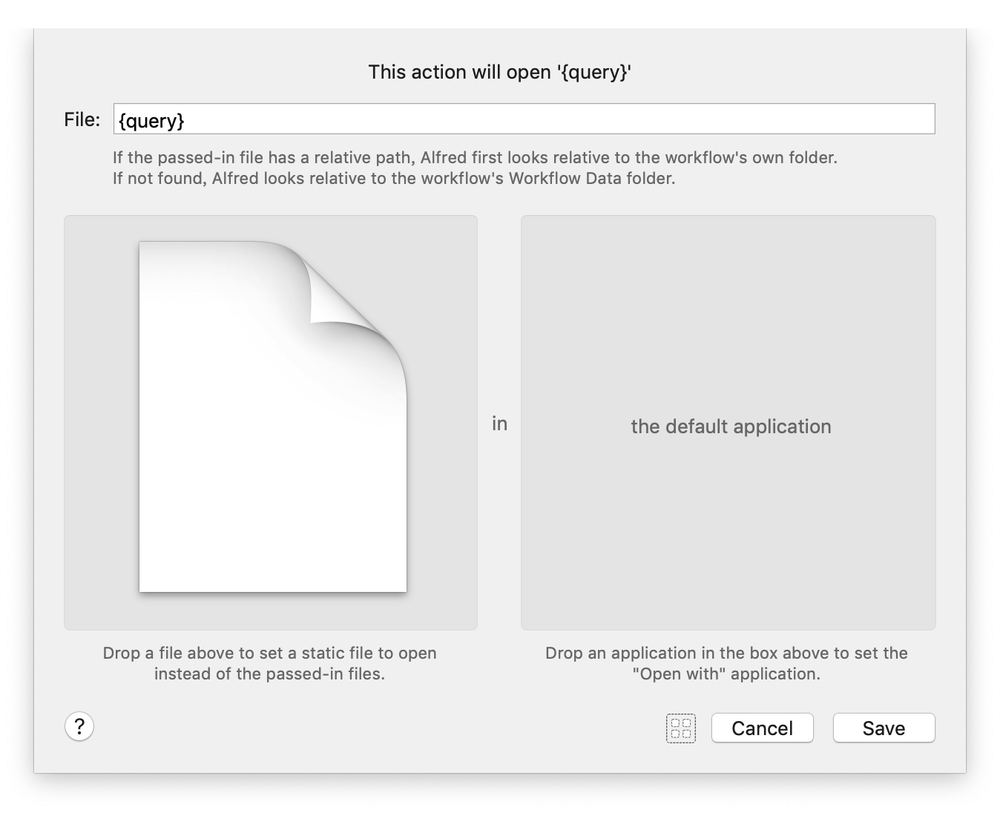
Reveal file in Finder：
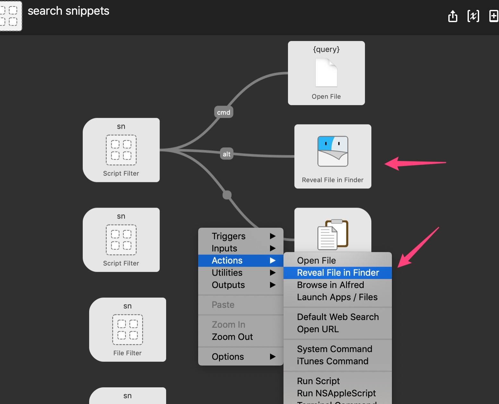

Copy to clipboard：
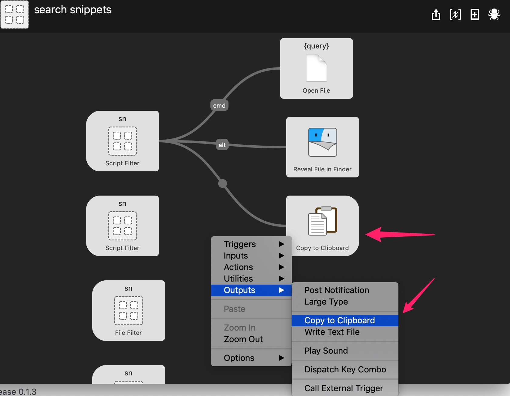

> 3. 执行：
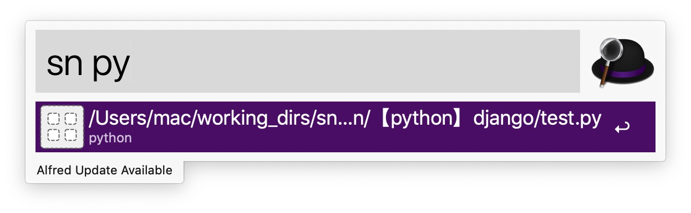

## 通过文件内容搜索文件
参考：https://github.com/BurntSushi/ripgrep
> 1. 安装ripgrepy包 https://pypi.org/project/ripgrepy/
> 2. 安装rg： brew install rg  
> 3. 配置workflow
创建第一个script filter
配置如下：
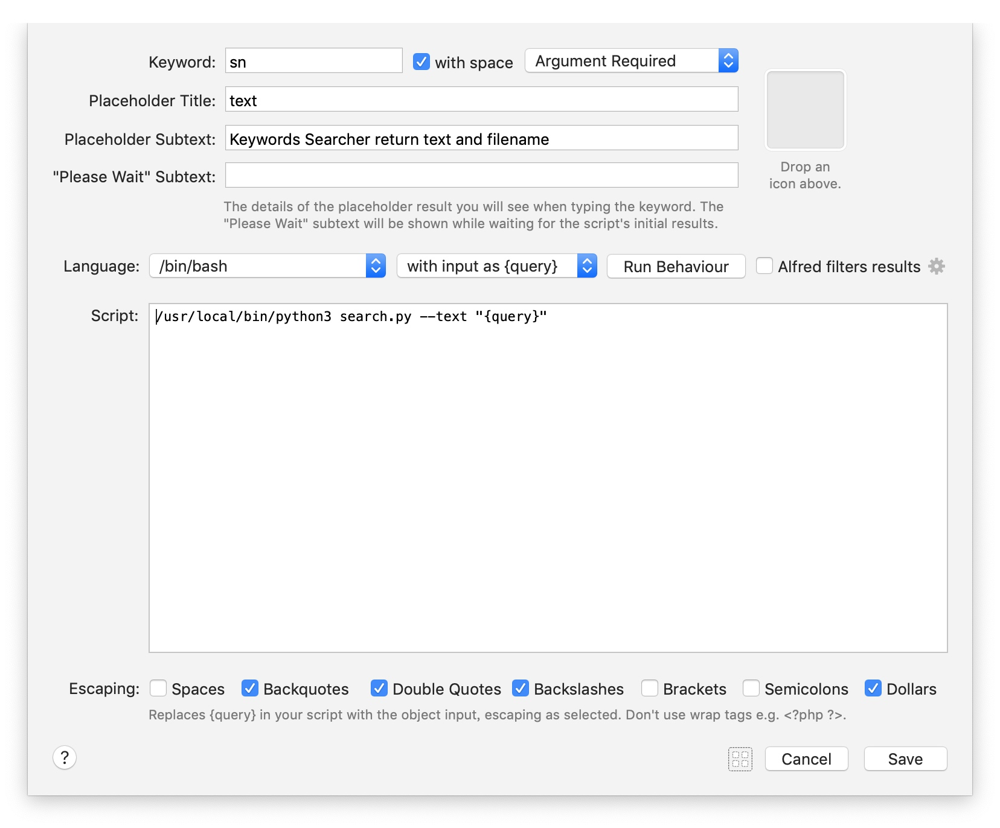

> 4. 执行：
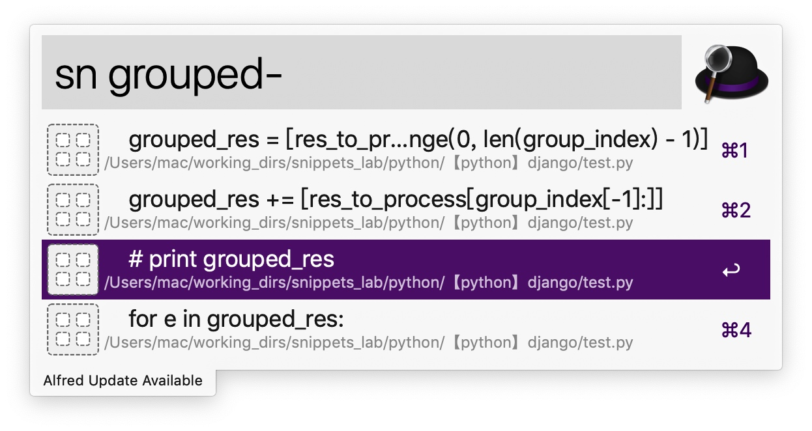

## 通过文件名搜索文件
直接使用alfred自带功能
创建file filter之后，配置如下：
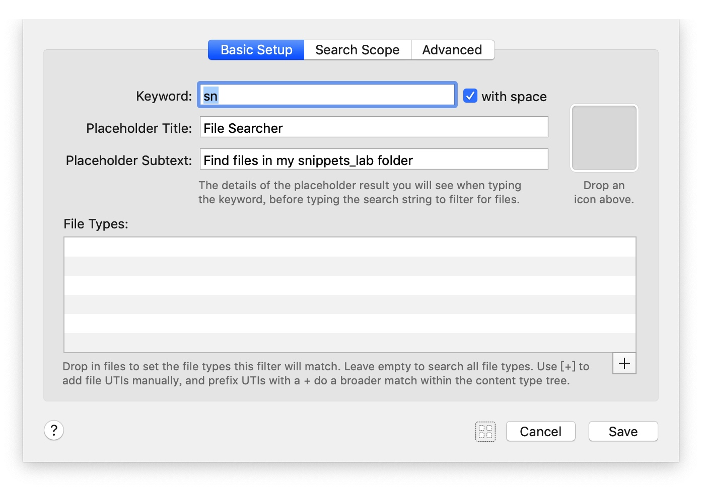
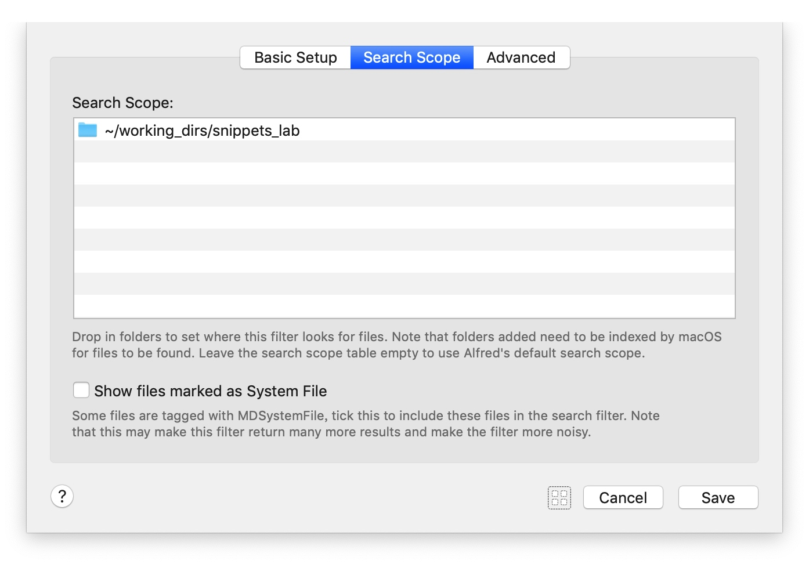
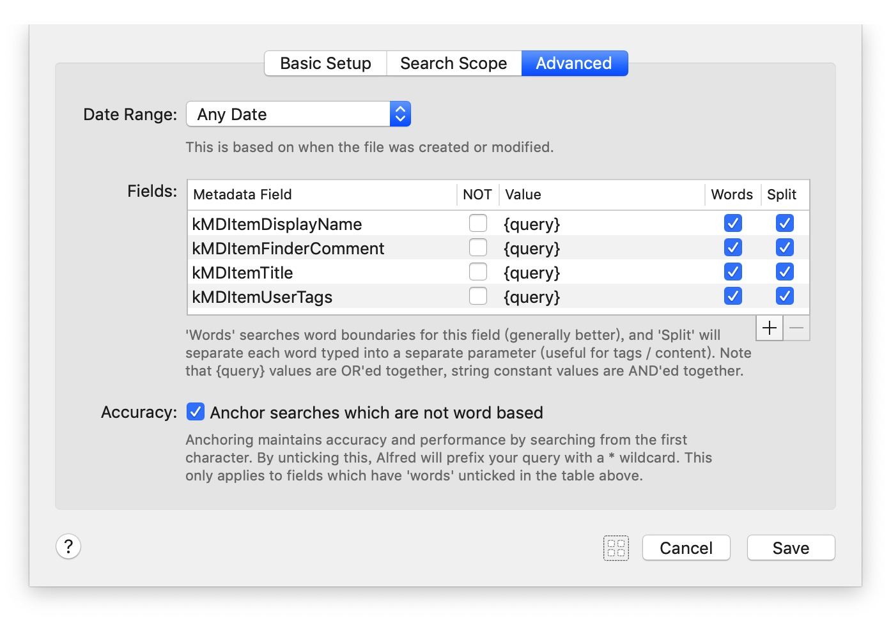
执行：
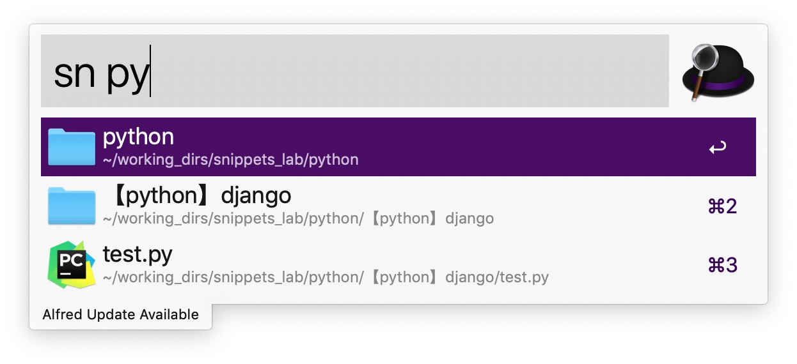

# TODO
- [ ] 多关键字搜索
- [ ] 使用whoosh加快搜索速度
- [ ] 在workflow中创建snippets并保存到自定义目录
